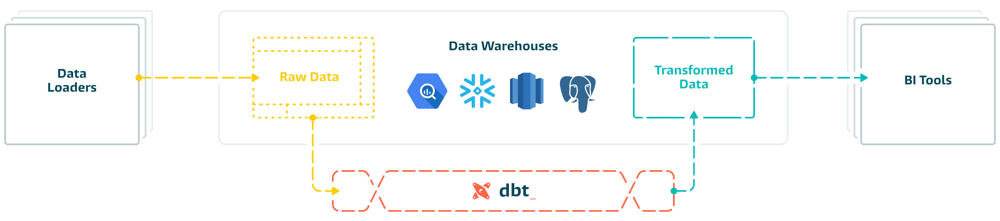

# dbt_with_sqlite3

### Purpose
The purpose of this task is to test the SQL data and models for the expected output.SQL unit testing is very important for data warehouse systems for data validation and to make them work correctly and efficiently.

### Ways to test the SQL models.
1. with tool `(DBT)`
2. without tool

### DBT 
`DBT` is an open-source command line tool that helps analysts and engineers transform data in their warehouse more effectively.

### Benefits of DBT.
1. Quickly and easily provide clean, transformed data ready for analysis.
2. Can build reusable and modular code.
3. Can easily integrate with CI/CD or airflow
4. Easy to use for non engineers
5. Extremely flexible data model (recreate data easily, backfills are easy)
6. Built in testing for data quality.

### Requirement - How you validate your source, intermediate and final results for the below queries.
1. We want to list the names and gold medal count of all athletes with three or more gold medals over all games, starting with the ones with the most gold medals.
2. For each region, we want to show the region average of the second tallest athlete of each country over all games.

The dataset is contained in this SQLite database file.Please refer the `/dataset/data_models.db`.It contains following tables data.
1. countries
2. summer_games
3. winter_games
4. athletes

### Unit test cases that we should consider.
1. unique : the `athletic_id` column in the `athletes` model should be unique
2. not_null : the `athletic_id` column in the `athletes` model should not contain null values
3. accepted_values : the medal column in the `summer_games/winter_games` should be one of `gold'`, `bronze`,  or `silver`
4. relationships : each `athletic_id` in the `athletes` model exists as an id in the summer_games/winter_games table (also known as referential integrity)

    

